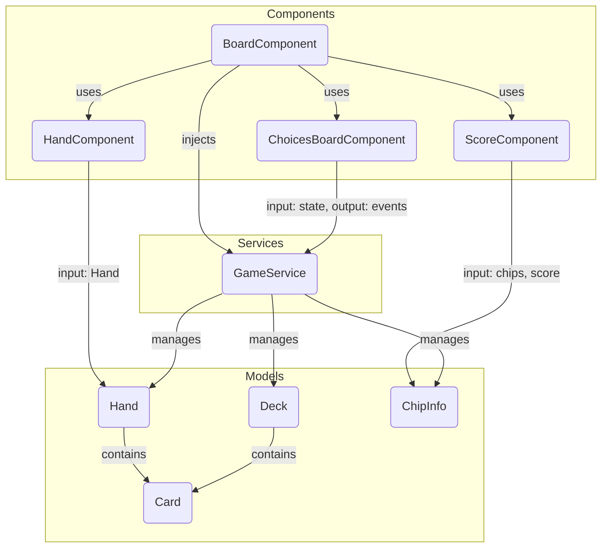

# Blackjack

This project was generated using [Angular CLI](https://github.com/angular/angular-cli) version 19.2.3.

## Development server

After cloning the repo, if it's the first time running the project, run:

```bash
npm install
```

To start a local development server, run:

```bash
npm start
```

Once the server is running, open your browser and navigate to `http://localhost:4200/`. The application will automatically reload whenever you modify any of the source files.

## Building

To build the project run:

```bash
npm run build
```

This will compile your project and store the build artifacts in the `dist/` directory. By default, the production build optimizes your application for performance and speed.

## Running unit tests

To execute unit tests with the [Karma](https://karma-runner.github.io) test runner, use the following command:

```bash
npm run test
```

## 🧩 Project Components Overview

### `BoardComponent`

- **File:** board.component.ts
- **Description:**  
  The main game container. It orchestrates the game flow and layout, providing the structure for the player and dealer hands, the score display, and the choices board. It injects the `GameService` to manage game state and actions.

---

### `HandComponent`

- **File:** hand.component.ts
- **Description:**  
  Displays a hand of cards (either the player's or the dealer's). Handles the animation and delay logic for dealing cards, and receives a `Hand` model as input. Used for both the player and dealer hands.

---

### `ScoreComponent`

- **File:** score.component.ts
- **Description:**  
  Shows the current score and the player's chips. Animates chips as they are bet or won/lost. Reacts to changes in the number of chips and bet size, and visually distinguishes chips that are currently in play.

---

### `ChoicesBoardComponent`

- **File:** choices-board.component.ts
- **Description:**  
  Renders the action buttons (Hit, Stand, Restart, etc.) and game messages. Handles user input for game actions and displays contextual messages (e.g., win/loss, out of money). Also manages button states and animations based on the game state.

---

## 🗂️ Architecture Overview (Mermaid format)



### **How to read this diagram:**

- **BoardComponent** is the main container and uses the other components.
- **GameService** is injected into BoardComponent and manages the game state.
- **HandComponent** receives a `Hand` model as input.
- **ScoreComponent** displays chip and score info, using `ChipInfo`.
- **ChoicesBoardComponent** interacts with the service for game actions.
- **GameService** manages the main models: `Hand`, `Deck`, and `ChipInfo`.
- **Hand** and **Deck** both contain `Card` objects.

## 🃏 Blackjack - Game Rules and How to Play

### 🎯 Objective

The goal of Blackjack is to beat the dealer by having a hand value as close to **21** as possible **without going over**. You win by:

- Having a higher hand value than the dealer.
- The dealer going over 21 ("busting").
- Getting a "Blackjack" (an Ace and a 10-point card) on the first two cards.

---

### 🧩 Card Values

| Card    | Value                                             |
| ------- | ------------------------------------------------- |
| 2–10    | Face value                                        |
| J, Q, K | 10 points                                         |
| Ace (A) | 1 or 11 points (whichever benefits the hand more) |

---

### 🎮 Game Flow

1. **Start the Game**

   - The player and dealer are each dealt **two cards**.
   - The player's cards are both visible.
   - The dealer has **one card face-up**, one face-down.

2. **Player Turn**

   - The player can choose to:

     - `Hit` – draw another card.
     - `Stand` – end their turn.

   - The player can continue hitting until they:

     - Stand, or
     - Bust (hand goes over 21 – automatic loss).

3. **Dealer Turn**

   - Once the player stands or busts:

     - The dealer reveals their hidden card.
     - The dealer **must hit** until their hand value is **17 or higher**.
     - The dealer **must stand** on **17 or more**.

4. **Determine the Outcome**

   - If the player busts → **Dealer wins**.
   - If the dealer busts → **Player wins**.
   - If neither busts → Compare hand values:

     - Higher value wins.
     - Tie results in a **push** (no one wins).

---

### 🏆 Blackjack

- If the player's **first two cards** total **21** (Ace + 10-point card), it is a **Blackjack**.
- A natural Blackjack (Ace + 10-point card) beats a 21 achieved with more than two cards.

---

### ✋ Optional Rules (Advanced Features) [NOT IMPLEMENTED YET - FUTURE VERSIONS]

You may optionally implement these features in future versions:

- **Double Down** – Double the bet, draw one final card, then stand.
- **Split** – If the first two cards are the same, split into two separate hands.
- **Insurance** – If dealer's upcard is an Ace, player can bet on the dealer having Blackjack.
- **Surrender** – Player forfeits half their bet to fold their hand early.

---

### Content Sources

**Cards SVGs taken from https://www.me.uk/cards/makeadeck.cgi?view**

**Github Copilot has been used in helping creating this documentation as well as test cases for the unit tests**

**No advanced libraries for state management (such as NGRX) have been used, as it's a simple application**

**This application runs as a standalone, without the need of a backend service -- If it was ever needed to have a multiplayer game, to avoid cheating, multiple services implemented here would be moved to the backend**
